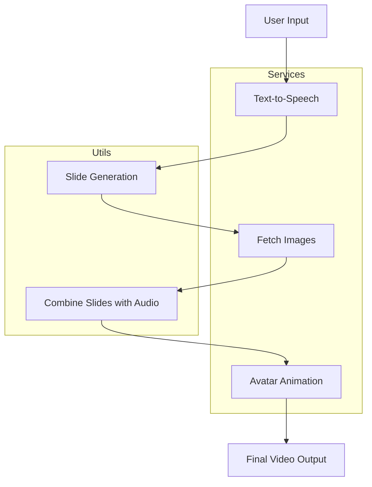

# AI Video Generator

This project is an AI-powered video generator that creates slides and combines them with synthesized audio based on user input text. The generated video includes a dynamic avatar that responds to the narration. The project utilizes services such as Unsplash for images, Microsoft Azure's text-to-speech for audio, and various utilities for image processing and video generation.

## Table of Contents
- [Features](#features)
- [Installation](#installation)
- [Usage](#usage)
- [Project Architecture](#project-architecture)
- [Technologies Used](#technologies-used)
- [Contributing](#contributing)
- [License](#license)

## Features
- **Text-to-Slide Generation**: Automatically generates slide content based on user input.
- **Text-to-Speech**: Synthesizes speech from text using Microsoft Azure TTS API.
- **Unsplash API**: Fetches relevant images based on keywords in the slide content.
- **Slide-to-Video**: Combines slides and audio into a final video presentation.
- **Avatar Animation**: Creates an animated avatar that moves based on the audio input.

## Installation

1. **Clone the Repository**:
   ```bash
   git clone https://github.com/yourusername/ai-video-generator.git
   cd ai-video-generator
   ```

2. **Install Dependencies**:
   Make sure to have Python 3.8+ installed, then install the required libraries using pip:
   ```bash
   pip install -r requirements.txt
   ```

3. **Set Up Environment Variables**:
   Create a `.env` file in the project root directory and add the following API keys:
   ```plaintext
   UNSPLASH_ACCESS_KEY=your_unsplash_api_key
   AZURE_TTS_KEY=your_azure_tts_key
   IMAGEMAGICK_PATH=C:\Program Files\ImageMagick-7.1.1-Q16-HDRI\magick.exe  # Adjust the path according to your setup
   ```

4. **Install ImageMagick**:
   Download and install [ImageMagick](https://imagemagick.org/script/download.php) and ensure it's added to your system's PATH.

## Usage

1. **Run the Streamlit App**:
   Run the following command to start the application:
   ```bash
   streamlit run app.py
   ```

2. **Generate a Video**:
   - Enter your text in the input box.
   - Click "Generate Video" to process your input and create a video.
   - Download or view the generated video directly from the Streamlit interface.

## Project Architecture



### Architecture Overview:
- **User Input**: The user inputs text that is converted into slides and audio narration.
- **Text-to-Speech API**: Converts the input text to speech using Microsoft Azure's TTS service.
- **Slide Generation**: Automatically generates titles, bullet points, and relevant slide content.
- **Fetch Images**: Using keywords extracted from the slide content, the Unsplash API fetches relevant images.
- **Combine Slides with Audio**: Slides are merged with the generated audio using MoviePy to create the video.
- **Avatar Animation**: The avatar responds to the audio, adding dynamism to the video presentation.
- **Final Output**: The generated video is made available for download.

## Technologies Used
- **Python**: Core programming language used for backend logic.
- **Streamlit**: Frontend UI for generating the video through a web interface.
- **Microsoft Azure TTS API**: Converts text to human-like speech.
- **Unsplash API**: Fetches relevant images for slide backgrounds.
- **Pillow**: For image processing.
- **MoviePy**: For video generation and combining slides with audio.
- **ImageMagick**: For image manipulation and conversion.
- **Mermaid**: For visualizing the project architecture.

## Contributing
We welcome contributions! Please follow these steps:
1. Fork the repository.
2. Create a new branch (`git checkout -b feature-branch`).
3. Commit your changes (`git commit -m 'Add new feature'`).
4. Push to the branch (`git push origin feature-branch`).
5. Open a pull request.

## License
This project is licensed under the MIT License. See the [LICENSE](LICENSE) file for more details.
